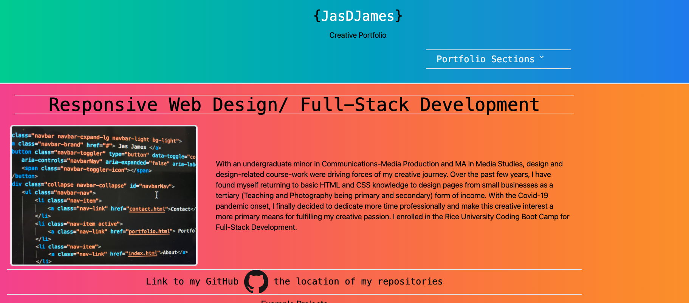

https://tailwindcomponents.com/component/profile-card-with-image-background

https://medium.com/@milanchheda/sticky-footer-using-tailwind-css-1c757ea729e2

Creative Portfolio

## Description

This project is a revamped portfolio using React

## Table of Contents

- [Installation](#installation)
- [Usage](#usage)
- [Contributing](#contributing)
- [Tests](#tests)
- [Questions](#questions)
- [License](#license)

## Installation

This projected will be deployed and ready to use upon deployment

[Repo](https://github.com/jasdjames/portfolio-creative)
[Deployed]()

## Usage

There are 3 sections of interest in the popover/dropdown and a contact page that the user my view.

## Contributing

Most of the information used to create this site were resources provided by my instructor, my tutor, documentation and resources provided to me like the ones below.

[Card in Tailwinds](https://tailwindcomponents.com/component/profile-card-with-image-background)

[Sticky Footer](https://medium.com/@milanchheda/sticky-footer-using-tailwind-css-1c757ea729e2)

## Tests

No Tests were written for this project

## Questions

For more information my contact information is below and also available on the deployed sites contact page.
[JasDJames]
(https://github.com/JasDJames)
jasdjames@gmail.com

## License

MIT
MIT License

    Copyright (c) [2021] [JasDJames]

    Permission is hereby granted, free of charge, to any person obtaining a copy
    of this software and associated documentation files (the "Software"), to deal
    in the Software without restriction, including without limitation the rights
    to use, copy, modify, merge, publish, distribute, sublicense, and/or sell
    copies of the Software, and to permit persons to whom the Software is
    furnished to do so, subject to the following conditions:

    The above copyright notice and this permission notice shall be included in all
    copies or substantial portions of the Software.

    THE SOFTWARE IS PROVIDED "AS IS", WITHOUT WARRANTY OF ANY KIND, EXPRESS OR
    IMPLIED, INCLUDING BUT NOT LIMITED TO THE WARRANTIES OF MERCHANTABILITY,
    FITNESS FOR A PARTICULAR PURPOSE AND NONINFRINGEMENT. IN NO EVENT SHALL THE
    AUTHORS OR COPYRIGHT HOLDERS BE LIABLE FOR ANY CLAIM, DAMAGES OR OTHER
    LIABILITY, WHETHER IN AN ACTION OF CONTRACT, TORT OR OTHERWISE, ARISING FROM,
    OUT OF OR IN CONNECTION WITH THE SOFTWARE OR THE USE OR OTHER DEALINGS IN THE
    SOFTWARE.
